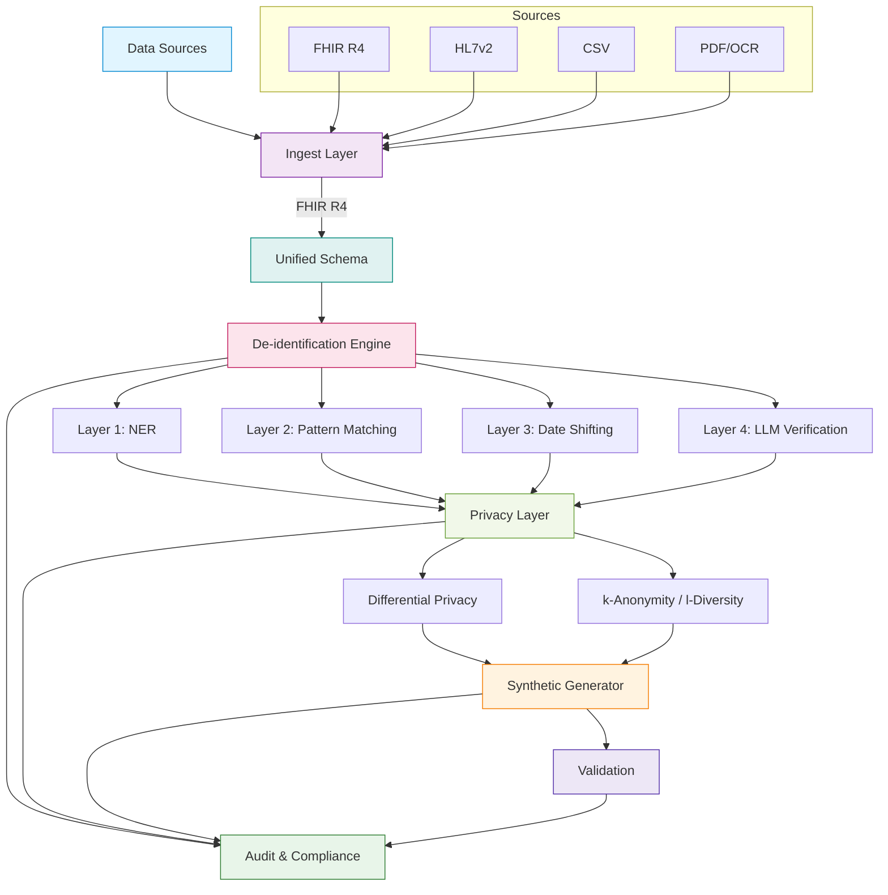

# healthpipe

[](https://github.com/sushaan-k/healthpipe/actions)
[](https://pypi.org/project/healthpipe/)
[](https://pypi.org/project/healthpipe/)
[](https://www.python.org/downloads/)
[](https://www.hhs.gov/hipaa/for-professionals/privacy/special-topics/de-identification/index.html)
[](LICENSE)

**Privacy-preserving clinical data pipeline with HIPAA-compliant de-identification, differential privacy, and synthetic data generation.**

---

## At a Glance

- Unified ingest layer for FHIR, HL7v2, CSV, and PDF/OCR inputs
- Multi-layer de-identification with safe-harbor oriented controls
- Differential privacy utilities and privacy-budget tracking
- Synthetic data generation, validation, lineage, and audit reporting

## The Problem

Healthcare AI is stuck. Not because the models are bad -- because the **data infrastructure is broken**.

Every health tech startup hits the same wall:

1. Clinical data is messy (HL7v2, FHIR, CSV dumps, PDFs, faxes)
2. Privacy requirements are brutal (HIPAA, state laws, IRB)
3. De-identification is manual or built on brittle regex
4. There is no standard pipeline for ingest -> de-identify -> transform -> analyze
5. Synthetic data for dev/testing does not exist in a usable form

**80% of health AI engineering time is spent on data wrangling.** Most startups build bespoke pipelines that cannot be reused or audited.

## The Solution

`healthpipe` is an open-source framework that provides the full pipeline: **ingest, de-identify, apply differential privacy, generate synthetic data, and audit everything** -- with formal privacy guarantees, not just "we removed the names."

## Quick Start

```bash
pip install healthpipe
```

### Ingest from any source

```python
import asyncio
from healthpipe import ingest, FHIRSource, CSVSource, HL7v2Source

async def main():
    dataset = await ingest([
        FHIRSource(url="https://fhir.hospital.org/R4"),
        CSVSource(path="./patient_data.csv", mapping="auto"),
        HL7v2Source(path="./hl7_messages/*.hl7"),
    ])

    print(dataset.patients.count())
    print(dataset.observations.count())

asyncio.run(main())
```

### De-identify with HIPAA Safe Harbor

```python
import asyncio
from healthpipe import deidentify

async def main():
    # ... (ingest dataset as above) ...

    deidentified = await deidentify(
        dataset,
        method="safe_harbor",
        date_shift=True,
        date_shift_salt="YOUR-SECRET-SALT-HERE",  # required, keep secret
        date_shift_range=(-365, 365),
        llm_verification=True,
        llm_model="claude-haiku-4-5",
    )

    print(deidentified.audit_log)
    # [PHI Removed] PATIENT_NAME "a1b2c3..." -> "[PATIENT_NAME]" (NER, confidence: 0.99)
    # [PHI Removed] SSN "d4e5f6..." -> "[SSN]" (PATTERN, confidence: 1.00)
    # [Date Shifted] offset=142 days (DATE_SHIFT)

asyncio.run(main())
```

### Differentially private statistics

```python
from healthpipe import private_stats, Count, Mean, Histogram

stats = private_stats(
    deidentified,
    epsilon=1.0,
    queries=[
        Count(field="patient", group_by="diagnosis"),
        Mean(field="lab_results.glucose", group_by="age_group"),
        Histogram(field="medications", bins=20),
    ],
)
print(f"Privacy budget remaining: {stats.budget_remaining}")
print(stats.results["count:patient|group_by:diagnosis"])
```

### Synthetic data generation

```python
import asyncio
from healthpipe import synthesize, evaluate_utility

async def main():
    # ... (de-identify dataset as above) ...

    synthetic = await synthesize(
        deidentified,
        n_patients=10_000,
        method="gaussian_copula",
        validate=True,
    )

    utility = evaluate_utility(synthetic, deidentified)
    print(f"Statistical fidelity: {utility.fidelity:.2%}")
    print(f"Re-identification risk: {utility.reidentification_risk:.6f}")

asyncio.run(main())
```

## Architecture



### De-identification: Four Layers

| Layer | Technique | What It Catches |
|-------|-----------|-----------------|
| 1 | **Named Entity Recognition** | Patient names, locations, organizations |
| 2 | **Pattern Matching** | SSN, phone, email, MRN, IP, ZIP codes |
| 3 | **Date Shifting** | All dates (preserves intervals between events) |
| 4 | **LLM Verification** | Context-dependent identifiers regex misses |

### HIPAA Safe Harbor Coverage

The following table details coverage of the 18 HIPAA Safe Harbor identifiers:

| Identifier | Detection Method | Automatic | Notes |
|---|---|---|---|
| Names | NER + Pattern | ✓ | All patient, provider, contact names |
| Geographic units < 20k population | Pattern | ✓ | ZIP code + location matching |
| Dates (except year) | Date Shift | ✓ | All dates shifted uniformly per record |
| Phone numbers | Pattern | ✓ | Regex + NER validation |
| Fax numbers | Pattern | ✓ | Regex + NER validation |
| Email addresses | Pattern | ✓ | RFC 5322 regex + NER |
| SSN | Pattern | ✓ | XXX-XX-XXXX format |
| Medical record numbers | Pattern + NER | ✓ | MRN-specific regex + context |
| Health plan numbers | Pattern | ✓ | Common format detection |
| Account numbers | Pattern | ✓ | Numeric pattern matching |
| License/vehicle plate | Pattern | ⚠ | Manual review recommended |
| IP addresses | Pattern | ✓ | IPv4 + IPv6 detection |
| URLs | Pattern | ✓ | Full URL extraction |
| Biometric identifiers | NER + LLM | ⚠ | Requires LLM verification pass |
| Full-face images | Manual | — | Requires manual redaction |
| Unique identifying codes | Context | ⚠ | May require domain knowledge |
| Implant serial numbers | Context | ⚠ | Clinical NER context-dependent |
| Generic identifiers | LLM | ⚠ | Requires verification pass |

✓ = Fully automated | ⚠ = Requires verification or domain knowledge | — = Requires manual handling

## Installation

**Core (no heavy ML dependencies):**

```bash
pip install healthpipe
```

**With optional components:**

```bash
# NLP (spaCy for clinical NER)
pip install healthpipe[nlp]

# OCR (PDF extraction)
pip install healthpipe[ocr]

# Differential privacy (OpenDP)
pip install healthpipe[dp]

# Synthetic data (SDV/CTGAN)
pip install healthpipe[synthetic]

# LLM verification (Anthropic)
pip install healthpipe[llm]

# Everything
pip install healthpipe[all]
```

## CLI

```bash
# Ingest a CSV file
healthpipe ingest ./patients.csv --format csv -o dataset.json

# De-identify
healthpipe deidentify dataset.json -o deidentified.json --audit-log audit.json

# Generate synthetic data
healthpipe synthesize deidentified.json -o synthetic.json --n-patients 5000

# View audit log
healthpipe audit audit.json --format summary
```

## Project Structure

```
src/healthpipe/
    __init__.py          # Public API
    pipeline.py          # Main orchestration
    cli.py               # Click CLI
    exceptions.py        # Custom exception hierarchy
    ingest/
        fhir.py          # FHIR R4 source
        hl7v2.py         # HL7v2 parser
        csv_mapper.py    # CSV -> FHIR mapping
        pdf_ocr.py       # PDF extraction (OCR)
        schema.py        # Unified internal schema
    deidentify/
        ner.py           # Clinical NER (spaCy + fallback)
        patterns.py      # Regex pattern matching
        date_shift.py    # Date shifting
        llm_verify.py    # LLM verification pass
        safe_harbor.py   # HIPAA Safe Harbor orchestration
    privacy/
        differential.py  # Laplace / Gaussian mechanisms
        k_anonymity.py   # k-Anonymity / l-Diversity
        budget.py        # Privacy budget tracking
    synthetic/
        generator.py     # Gaussian copula / CTGAN
        validator.py     # Re-identification risk testing
        utility.py       # Utility evaluation
    audit/
        logger.py        # Structured audit logging
        lineage.py       # Data lineage tracking
        compliance.py    # Compliance report generation
```

## Demo

Run the offline walkthrough with:

```bash
uv run python examples/demo.py
```

For CSV, FHIR, and synthetic-data scenarios, see the larger examples in `examples/`.

## Development

```bash
# Clone and install
git clone https://github.com/sushaan-k/healthpipe.git
cd healthpipe
pip install -e ".[dev]"

# Run tests
pytest tests/ -v --cov=healthpipe

# Lint
ruff check src/ tests/
ruff format src/ tests/

# Type check
mypy src/healthpipe/
```

## Technical Stack

| Component | Library |
|-----------|---------|
| Data models | `pydantic` v2 |
| FHIR/HTTP | `httpx` (async) |
| Clinical NER | `spaCy` (optional) |
| OCR | `pytesseract` (optional) |
| Differential privacy | `opendp` (optional) |
| Synthetic data | `sdv` / `ctgan` (optional) |
| Numerics | `numpy`, `pandas`, `pyarrow` |
| CLI | `click` |

## Privacy Guarantees

- **Formal differential privacy** via Laplace and Gaussian mechanisms with composable epsilon budget tracking
- **k-Anonymity / l-Diversity** enforcement with automatic generalization and suppression
- **Re-identification risk validation** using Distance to Closest Record (DCR) metrics
- **HIPAA Safe Harbor** compliance with all 18 identifier types addressed (14 auto-detected; 3 require manual review -- see compliance report)
- **Audit trail** with SHA-256 hashed PHI values at construction time (the audit log itself cannot leak data; raw PHI is never stored by default)

## Contributing

Contributions are welcome. Please:

1. Fork the repository
2. Create a feature branch (`git checkout -b feature/amazing-feature`)
3. Write tests for your changes
4. Ensure `pytest`, `ruff check`, and `mypy` pass
5. Open a Pull Request

## License

MIT License. See [LICENSE](LICENSE) for details.

---

Built by [Sushaan Kandukoori](https://github.com/sushaan-k) | [vytus.health](https://vytus.health)
